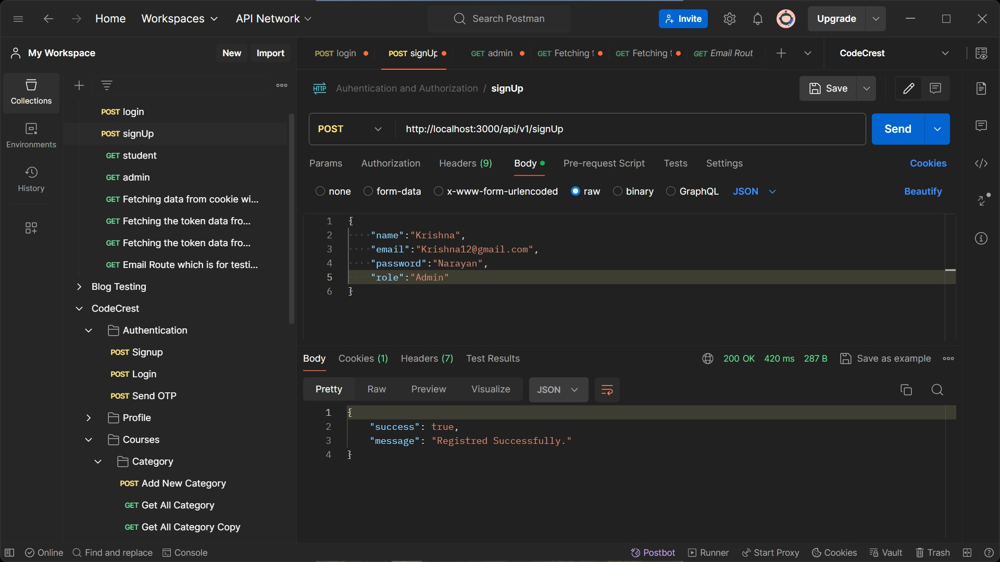
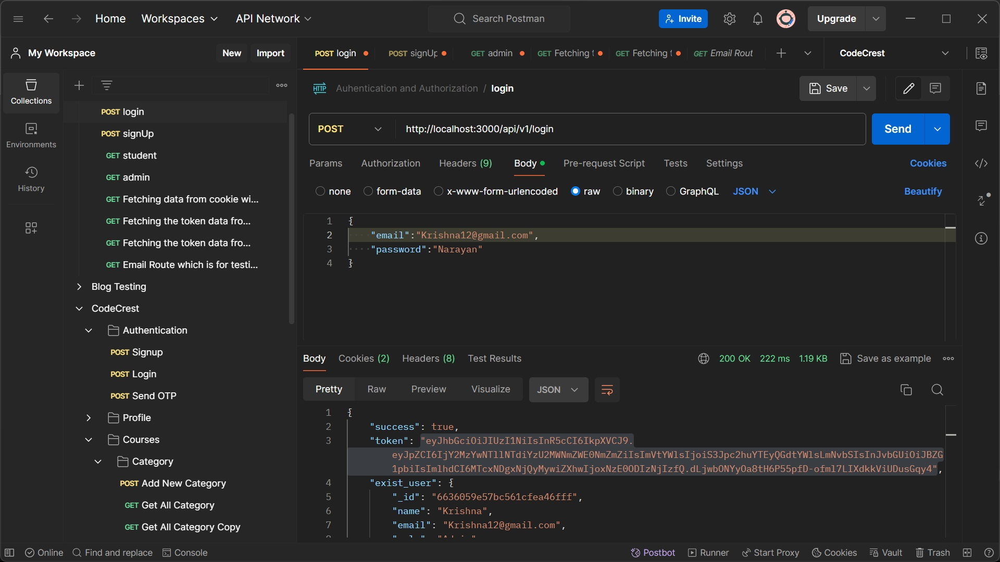
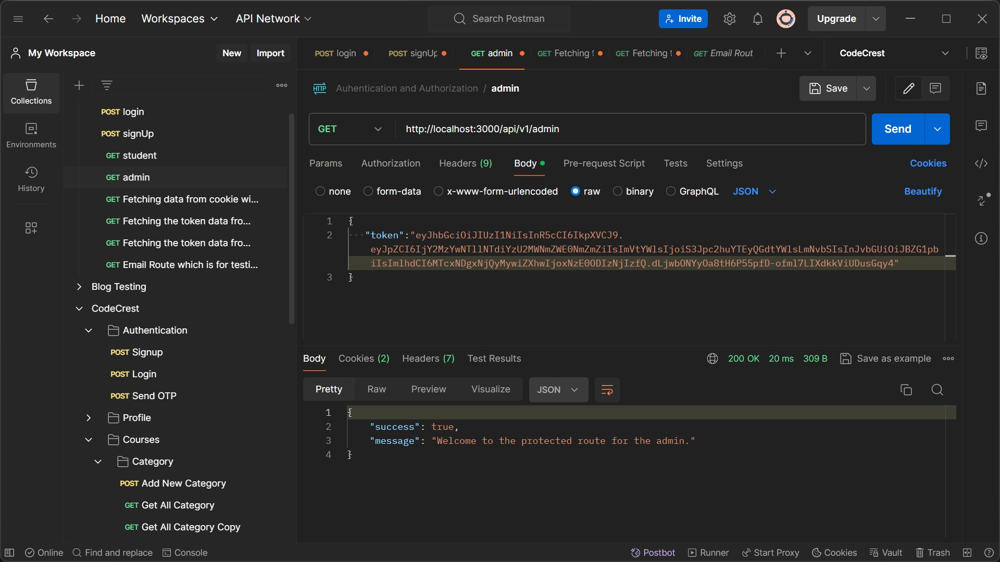

# Authentication-Application-Backend

# Project Description

## Need
In modern web applications, user authentication and authorization are essential components for ensuring security and controlling access to resources. Implementing a robust authentication system is crucial for protecting sensitive user data and preventing unauthorized access. This project addresses the need for a secure and reliable authentication mechanism by providing a Node.js-based solution with features such as user registration, login, JWT authentication, and role-based authorization.

## Overview
This Node.js project implements user authentication and authorization functionalities using Express.js and MongoDB. It provides endpoints for user registration, login, and access control based on user roles.

## Features
- **User Registration:** Users can register by providing their name, email, password, and role. Passwords are securely hashed before storage.
- **User Login:** Registered users can log in using their email and password. Upon successful login, a JWT token is generated for authentication.
- **JWT Authentication:** JSON Web Tokens (JWT) are used for stateless authentication. Tokens are signed with a secret key and verified for each request to protected routes.
- **Role-Based Authorization:** Middleware functions are implemented to restrict access to certain routes based on user roles (e.g., student, admin).
- **Secure Password Handling:** User passwords are hashed using bcrypt before storage to ensure security.
- **Database Connectivity:** The project connects to a MongoDB database using Mongoose for data storage and retrieval.

## Project Structure
- **Config Folder:** Contains configurations for database connection and environment variables.
- **Controllers Folder:** Includes controller functions for user registration and login.
- **Middleware Folder:** Contains middleware functions for authentication and role-based authorization.
- **Models Folder:** Defines the Mongoose schema for the User model.
- **Routes Folder:** Defines routes for user authentication and authorization.
- **Additional Files:**
  - **.env:** Configuration file for environment variables such as the port number, database URL, and JWT secret key.
  - **index.js:** Main entry point of the application, sets up the Express server, defines routes, and establishes a database connection.

## Usage
1. Ensure MongoDB is installed and running.
2. Create a `.env` file with configuration variables.
3. Run `npm install` to install dependencies.
4. Start the server with `npm start`.
5. Access the endpoints for user registration, login, and protected routes as defined in the routes.

## Dependencies
- **Express:** Web application framework for Node.js.
- **Mongoose:** MongoDB object modeling tool for Node.js.
- **bcrypt:** Library for hashing passwords securely.
- **jsonwebtoken:** Library for generating and verifying JSON Web Tokens.
- **dotenv:** Library for loading environment variables from a `.env` file.

## Conclusion
This project provides a robust authentication and authorization system for web applications, ensuring secure access control and user management. It can be easily integrated into various applications requiring user authentication functionalities.

## Preview
**Signup Route ->**

  

**Login Route ->**

  

**Fetching Admin details throw a token ->**

  

**Fetching Admin details throw a Bearer token ->**

  
